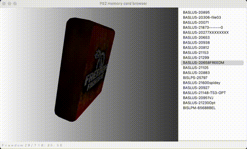

# ps2mc-browser


A PCSX2 memory card save file browser supports displaying 3D icons. The dependencies are:
- WxPython
- Numpy
- ModernGL
- GLM

# Quick Start
```shell
python3 wxwindow.py
```

Run the above command to open a GUI window. From the menu bar, select 'Open File' and then select the `.ps2` file from your computer. Then enjoy.

# Reference
- [gothi - icon.sys format](https://www.ps2savetools.com/documents/iconsys-format/)
- [Martin Akesson - PS2 Icon Format v0.5](http://www.csclub.uwaterloo.ca:11068/mymc/ps2icon-0.5.pdf)
- [Florian Märkl - mymcplus](https://git.sr.ht/~thestr4ng3r/mymcplus)
- [Ross Ridge - PlayStation 2 Memory Card File System](https://www.ps2savetools.com/ps2memcardformat.html)