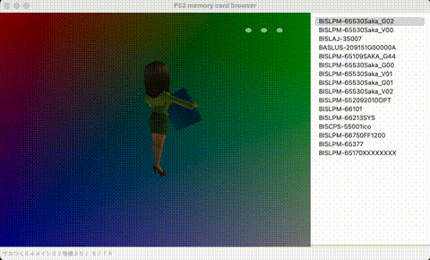

# ps2mc-browser
English | [中文](README_zh.md)


A PCSX2 memory card save file browser supports displaying 3D icons.

## What's New
3D icons can exhibit different actions based on mouse interactions.


## Dependencies
The dependencies are listed below:
- Python3
- WxPython
- Numpy
- ModernGL
- PyGlm

## Quick Start
```shell
python3 wxwindow.py
```

Run the above command to open a GUI window. From the menu bar, select `Open File` and then select the `.ps2` file from your computer.

## Documentation
- [Analyze the file system of the PS2 memory card](https://babyno.top/posts/2023/09/parsing-ps2-memcard-file-system/)
- [Export save files from the PS2 memory card](https://babyno.top/posts/2023/09/exporting-file-from-ps2-memcard/)
- [Analyze the 3D icons of PS2 game save files](https://babyno.top/posts/2023/10/parsing-ps2-3d-icon/)
- [Render the 3D icons of PS2 game save files using Python and OpenGL](https://babyno.top/posts/2023/10/rendering-ps2-3d-icon/)
- [Implementation of RLE algorithm in PS2](https://babyno.top/posts/2023/10/rle-algorithm-in-ps2/)
- [Texture image encoding algorithm A1B5G5R5 in PS2](https://babyno.top/posts/2023/10/ps2-texture-encoding-algorithm-a1b5g5r5/)


## Reference
- [gothi - icon.sys format](https://www.ps2savetools.com/documents/iconsys-format/)
- [Martin Akesson - PS2 Icon Format v0.5](http://www.csclub.uwaterloo.ca:11068/mymc/ps2icon-0.5.pdf)
- [Florian Märkl - mymcplus](https://git.sr.ht/~thestr4ng3r/mymcplus)
- [Ross Ridge - PlayStation 2 Memory Card File System](https://www.ps2savetools.com/ps2memcardformat.html)