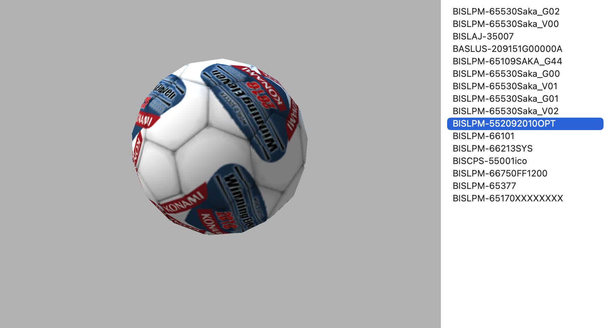
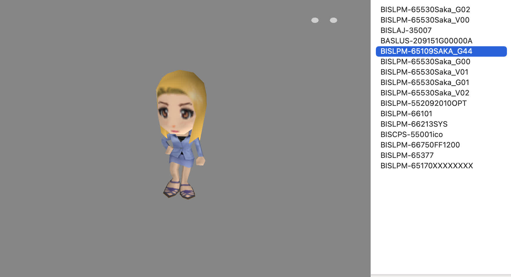
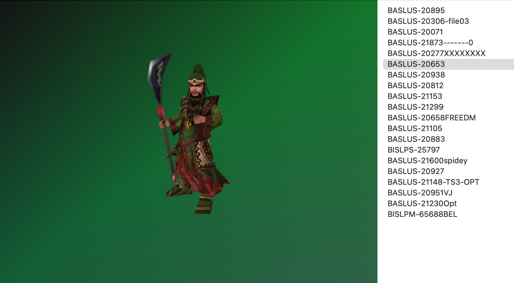

# ps2mc-browser
[English](README.md) | 中文


`ps2mc-browser` 是一个 `PS2` 存档文件查看器，它可以解析 `PS2` 存档中的 `3D` 图标的顶点和纹理等数据，然后利用 `OpenGL` 的能力将图标渲染出来。

如果你熟悉 `PS2` 或者对 `PS2` 存档有一定的了解，`ps2mc-browser` 会是一个非常有用的工具。它不仅可以帮助你查看和理解存档文件的结构，还能将这些存档在画布上以 `3D` 图标的形式展出。

## 新特性
3D图标可以根据鼠标的交互变化不同的动作。


## 快速开始
推荐使用`uv`创建虚拟环境运行。

```shell
uv venv --python python3.10
uv pip install ps2mc-browser
uv run ps2mc-browser
```

在命令行输入上述命令，会打开GUI窗口。在顶部菜单栏选择 `Open File` 并且选择你电脑硬盘上的 `PS2` 存档。

你也可以直接下载预编译的安装包:
👉 [https://github.com/caol64/ps2mc-browser/releases](https://github.com/caol64/ps2mc-browser/releases)

## 屏幕截图







## 文档
- [解析PS2记忆卡文件系统](https://babyno.top/posts/2023/09/parsing-ps2-memcard-file-system/)
- [从PS2记忆卡中导出存档文件](https://babyno.top/posts/2023/09/exporting-file-from-ps2-memcard/)
- [解析PS2游戏存档3D图标](https://babyno.top/posts/2023/10/parsing-ps2-3d-icon/)
- [使用Python和OpenGL渲染PS2存档3D图标](https://babyno.top/posts/2023/10/rendering-ps2-3d-icon/)
- [RLE算法在PS2中的应用](https://babyno.top/posts/2023/10/rle-algorithm-in-ps2/)
- [PS2纹理图片编码算法A1B5G5R5](https://babyno.top/posts/2023/10/ps2-texture-encoding-algorithm-a1b5g5r5/)
- [ps2mc-browser的着色器代码分析](https://babyno.top/posts/2023/12/ps2mc-browsers-shader-introduction/)

## 参考
- [gothi - icon.sys format](https://www.ps2savetools.com/documents/iconsys-format/)
- [Martin Akesson - PS2 Icon Format v0.5](http://www.csclub.uwaterloo.ca:11068/mymc/ps2icon-0.5.pdf)
- [Florian Märkl - mymcplus](https://git.sr.ht/~thestr4ng3r/mymcplus)
- [Ross Ridge - PlayStation 2 Memory Card File System](https://www.ps2savetools.com/ps2memcardformat.html)
