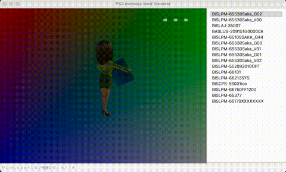

# ps2mc-browser
[English](README.md) | 中文


`PCSX2`存档查看器，支持显示存档里的3D动态图标。

## 新特性
3d图标可以根据鼠标的交互变化不同的动作。



## 依赖
ps2mc-browser依赖如下：
- Python3
- WxPython
- Numpy
- ModernGL
- PyGlm

## 快速开始
```shell
python3 wxwindow.py
```

在命令行输入上述命令，会打开GUI窗口。在顶部菜单栏选择`Open File`并且选择你电脑硬盘上的`PCSX2`存档。

## 文档
- [解析PS2记忆卡文件系统](https://babyno.top/posts/2023/09/parsing-ps2-memcard-file-system/)
- [从PS2记忆卡中导出存档文件](https://babyno.top/posts/2023/09/exporting-file-from-ps2-memcard/)
- [解析PS2游戏存档3D图标](https://babyno.top/posts/2023/10/parsing-ps2-3d-icon/)
- [使用Python和OpenGL渲染PS2存档3D图标](https://babyno.top/posts/2023/10/rendering-ps2-3d-icon/)
- [RLE算法在PS2中的应用](https://babyno.top/posts/2023/10/rle-algorithm-in-ps2/)
- [PS2纹理图片编码算法A1B5G5R5](https://babyno.top/posts/2023/10/ps2-texture-encoding-algorithm-a1b5g5r5/)

## 参考
- [gothi - icon.sys format](https://www.ps2savetools.com/documents/iconsys-format/)
- [Martin Akesson - PS2 Icon Format v0.5](http://www.csclub.uwaterloo.ca:11068/mymc/ps2icon-0.5.pdf)
- [Florian Märkl - mymcplus](https://git.sr.ht/~thestr4ng3r/mymcplus)
- [Ross Ridge - PlayStation 2 Memory Card File System](https://www.ps2savetools.com/ps2memcardformat.html)